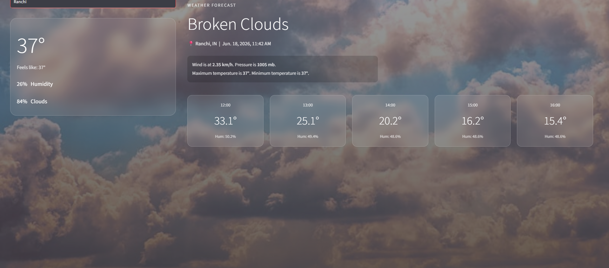
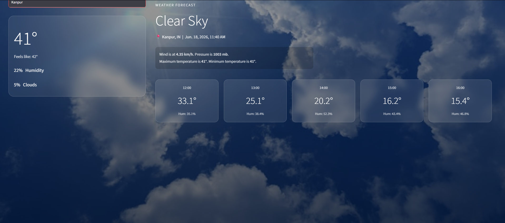

# 🌤️ Real-Time Weather Forecast & Predictive Analytics 

A dual-module, production-grade weather analysis pipeline designed to ingest live global atmospheric metrics via REST endpoints, map multi-variate environmental factors, and run localized Random Forest Regressors to compute future hourly micro-climatic trends.

---

## 🏗️ Production Architecture & File Structure

This application transitions standalone predictive modeling into an interactive, cloud-native orchestration layer:

| Component Path | Technical Responsibility | Core Mechanisms |
| :--- | :--- | :--- |
| 🗃️ **`weather.csv`** | Historical Baseline Dataset | Houses structured chronological climatic metrics for local ensemble initialization. |
| 🔑 **`.streamlit/secrets.toml`** | Context Security Vault | Ingests and sandboxes API credentials locally, explicitly hidden from public version control. |
| 📄 **`.gitignore`** | Decoupling & Isolation Directive | Prevents tracking of credential files (`secrets.toml`) and bytecode directories (`__pycache__/`). |
| 🚀 **`app.py`** | Reactive UI Engine & Predictive Pipeline | Fetches live metrics, maps local cached state parameters, and handles HTML5/CSS3 runtime layouts. |

---

## ⚙️ Data Engineering & Pipeline Dynamics

### 🔄 Atmospheric Ingestion Layer
* **Live Telemetry Extraction:** Performs asynchronous HTTP GET operations against OpenWeatherMap endpoints to extract exact runtime conditions (temperature, humidity, cloud density, and wind dynamics).
* **Robust Failover Context:** If the internal baseline dataset (`weather.csv`) encounters a structural exception or is missing, the execution pipeline instantly initializes a defensive fallback prediction engine to eliminate interface crashes.

### 🤖 Ensemble Forecasting Context
* Executes independent multi-output regression tracking utilizing **Random Forest Regressors**. The engine calculates localized non-linear parameters across shifting timelines:
  $$\text{Future\_Trend} = f(\text{Current\_Metric}_{t-1})$$
* Implements the localized `st.cache_data` caching framework over dataset ingestion points to mitigate latency overheads during frequent interactive query lookups.

---
---

## ---

## 📸 Enterprise Interface Preview

  <strong>1. Core Dynamic Analytics Dashboard</strong> 
  
     
  <strong>2. Predictive Model Forecasting Matrix</strong> 
  
     
  <strong>3. Statistical Data Diagnostics Panel</strong> 
  

---

